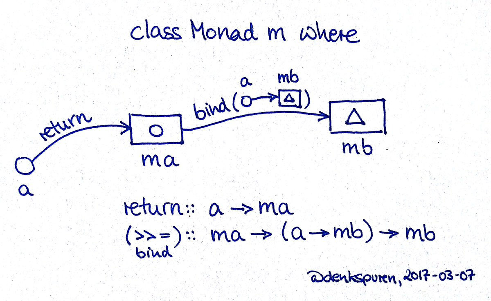
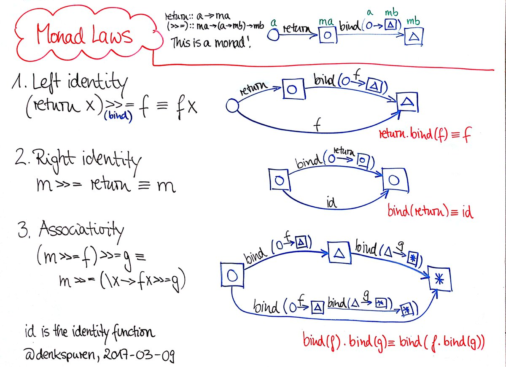

# Zaszłości

* `isGraphClosed` - https://gist.github.com
* `nth` przy użyciu `foldr` - https://github.com/mbenke/jnp3-haskell/blob/master/Code/fold/fold-nth.hs

## `foldl` i `foldr`

```
foldr f z (x:xs) = f x (foldr f z xs)
foldl f z (x:xs) = foldl (f z x) xs
```

W ML czesto preferowany jest `foldl` (jako ogonowy); w Haskellu raczej używamy `foldr`.

# I/O - co jest pod maską?

Rozwiązanie problemu I/O jest oparte na typach i klasach. Musimy powiedzieć o nich coś więcej, do I/O wrócimy za chwilę.

## Typy algebraiczne

```haskell
data Tree a = Leaf a | Branch (Tree a) (Tree a)

mapTree :: (a->b) -> Tree a -> Tree b
mapTree f (Leaf a) = Leaf (f a)
mapTree f (Branch l r) = Branch (m l) (m r) where
m = mapTree f
```
**Leaf** jest 1-argumentowym konstruktorem,
**Branch** — 2-argumentowym. Per analogiam mówimy, że **Tree** jest jednoargumentowym *konstruktorem typu*:

-   jeśli **x** jest wartością, to **Leaf x** jest wartością;
-   jesli **a** jest typem, to **Tree a** jest typem.

### Typy Maybe i Either

Dwa przydatne typy (predefiniowane w Prelude):

```haskell
    data Maybe a = Nothing | Just a
    data Either a b = Left a | Right b
    -- Prelude> head []
    -- *** Exception: Prelude.head: empty list

    safeHead :: [a] -> Maybe a
    safeHead [] = Nothing
    safeHead (x:_) = Just x
    -- *Main> safeHead []
    -- Nothing

    safeHead2 :: [a] -> Either String a
    safeHead2 [] = Left "Empty list"
    safeHead2 (x:xs) = Right x
```

### Synonimy

Czasem przydatne jest wprowadzenie własnej nazwy (synonimu) dla jakiegoś typu.

```haskell
    type Name = String
    type Possibly = Either Name
    
    safeHead3 :: [a] -> Possibly a
    safeHead3 [] = Left "Empty list"
    safeHead3 (x:xs) = Right x
```

Synonim **nie jest** konstruktorem typu; jest identyczny z nazywanym typem.

### Etykiety pól

Spójrzmy na definicje

```haskell
    data Point = Pt Float Float
    pointx                  :: Point -> Float
    pointx (Pt x _)         =  x
    pointy ...
```

Definicja **pointx** jest “oczywista”; możemy krócej:

```haskell
    data Point = Pt {pointx, pointy :: Float}
```

W jednej linii definiujemy typ **Point**, konstruktor **Pt**
oraz funkcje **pointx** i **pointy**.

### Opakowywanie typów: **newtype**

Jeśli chcemy opakować istniejacy typ w nowy konstruktor typu, mozemy uzyć konstrukcji **newtype**:

```haskell
    newtype Identity a = Identity { runIdentity :: a } 
      deriving (Eq, Show)
```

```
    *Newtype> Identity "Ala"
    Identity {runIdentity = "Ala"}
    *Newtype> runIdentity it
    "Ala"
```

**newtype** działa niemal identycznie jak **data** z jednym konstruktorem(ale efektywniej; 
pakowanie/odpakowywanie odbywa się w czasie kompilacji a nie wykonania).

### Klasy konstruktorowe

Typy polimorficzne jak **\[a\]** czy **Tree a** mogą być instancjami klas (przeważnie pod warunkiem, ze **a** jest też instancją odpowiedniej klasy)…

```haskell
    data Tree a = Leaf a | Branch (Tree a) (Tree a) 
      deriving Show

    instance Eq a => Eq (Tree a) where
      Leaf x == Leaf y = x == y
      Branch l r == Branch l' r' = (l==l')&&(r==r')
```

…ale są też klasy, których instancjami są nie typy, a *konstruktory typów*. Na przykład funkcję **map** możemy uogólnić na inne pojemniki:

```haskell
    -- Klasa Functor jest zdefiniowana w Prelude
    -- class  Functor t  where
    --    fmap :: (a -> b) -> t a -> t b

    (<$>) :: Functor f => (a -> b) -> f a -> f b
    (<$>) = fmap

    instance Functor Tree where
     fmap f (Leaf a) = Leaf $ f a
     fmap f (Branch l r) = Branch (fmap f l)(fmap f r)
```

```
    *Tree> negate <$> Leaf 6
    Leaf (-6)
```


-   Typy takie jak **Tree** czy listy są pojemnikami przechowującymi obiekty

-   Instancja **Eq(Tree a)** mówi o własnościach pojemnika z zawartością

-   Instancja **Functor Tree** mówi o własnościach samego pojemnika, *niezależnie od zawartości*


```haskell
    import Prelude hiding(Functor(..))

    class Functor f where
      fmap :: (a -> b) -> (f a -> f b)

    -- [] poniżej oznacza konstruktor *typu* dla list
    instance Functor [] where
      fmap = map

    instance Functor Maybe where
      fmap f (Just x) = Just (f x)
      fmap f Nothing = Nothing
```

### Applicative

Chcemy dodać dwie liczby opakowane w **Maybe**

    *Applicative> :t (+1) <$> Just 5
    (+1) <$> Just 5 :: Num b => Maybe b
    *Applicative> :t (+) <$> Just 5 
    (+) <$> Just 5 :: Num a => Maybe (a -> a)

czyli nie możemy napisać `(+) <$> Just 2 <$> Just 3`

W ogólności Functor nie wystarczy, potrzeba

```haskell
    class (Functor f) => Applicative f where
        pure  :: a -> f a
        (<*>) :: f (a -> b) -> f a -> f b
```

teraz:

    *Applicative> (+) <$> Just 2 <*> Just 3
    Just 5

Do klasy `Applicative` jeszcze wrócimy później.

### Ćwiczenia

:pencil: Rozważmy trochę iny typ drzew:

```haskell
data Tree a = Empty | Node a (Tree a) (Tree a)
```
Stwórz dla niego instancje klas `Eq`, `Show`, `Functor` (bez używania `deriving`).

:pencil: Rozważmy typy
```haskell
data TypeA a b
    = C1 a b
    | C2 [Maybe (a -> b)]

data TypeB f g a b
    = C3 (f a)
    | C4 (g b)
    | C5 (g (g [b]))
```
Zdefiniuj dla nich odpowiednie instancje `Functor`.

:pencil:  Zdefiniuj klasę Pointed (funkcyjnych pojemników z singletonem)
```haskell
class Functor f => Pointed f where
  pure :: a -> f a
```

i jej instancje dla list, `Maybe`, `Tree`:

```haskell
instance Pointed Maybe where
instance Pointed [] where ...
instance Pointed Tree where
```

### Obliczenia funkcyjne

Możemy zdefiniować typ, którego wartościami będą obliczenia,
z operacjami:

-   Obliczenie czyste (daje jakąś wartość, nie ma efektów ubocznych)

-   Sekwencjonowanie obliczeń:

    `obliczenie -> (wynik -> obliczenie) -> obliczenie`

-   Operacje pierwotne (np. wczytaj, wypisz, etc.)

Mechanizm wykonywania obliczeń (“interpreter”, maszyna wirtualna)

### Klasa Monad czyli programowalny średnik

```haskell
class Monad obliczenie where 
  return :: a -> obliczenie a 
  (>>=) :: obliczenie a -> (a -> obliczenie b) -> obliczenie b
```

-   Klasa **Monad** jest klasą konstruktorową (jak **Functor**).

-   Gdy **m** jest instancja **Monad**, to **m a** jest typem obliczeń o
    wyniku typu **a**.

-   **return x** jest czystym obliczeniem dającym wynik **x**

-   Operator `(>>=)` (zwany “bind”) sekwencjonuje obliczenia
    (“programowalny średnik”)

*Monads: just a fancy name for scripting your semicolons
(via @TacticalGrace, inspired by @donsbot)*



### Klasa Monad

Jeżeli kolejne obliczenie nie korzysta z wyniku (a tylko z efektu)
poprzedniego, możemy użyć operatora `(>>)`

    o1 >> o2 = o1 >>= \_ -> o2

    print A >> print B

Ponadto czasami wygodniej jest zapisywać złożenie obliczeń w kolejności
analogicznej do złożenia funkcji:

    f =<< o = o >>= f

### Najprostszy efekt: brak efektu

Najprostsza monadą jest **Identity**
(moduł **Control.Monad.Identity** w bibliotece standardowej)

```haskell
newtype Identity a = Identity { runIdentity :: a }

instance Monad Identity where 
  return a = Identity a     -- return = id
  (Identity x) >>= f = f x  -- x >>= f = f x
```

### Trzy prawa monadyki

Każda monada musi spełniać następujące prawa:

       1. (return x) >>= f == f x
       2. m >>= return == m
       3. (f >=> g) >=> h == f >=> (g >=> h)
    gdzie f >=> g = (\x -> (f x >>= g))

Pierwsze dwa prawa mówią, że *return* nie ma efektów.

Trzecie prawo mówi, że sekwencjonowanie obliczeń jest łączne,
czyli w pewnym sensie, że

     (o1;o2);o3 === o1;(o2;o3)

…i możemy je traktować jako sekwencję `o1;o2;o3`

Podobnie jak zapis `a+b+c` jest jednoznaczny dzięki łączności dodawania.




## Prosty efekt: obliczenia zawodne

**Cel:** chcemy modelować obliczenia, które czasem czasem zawodzą

**Środek:** monada `Maybe`

```haskell
instance Monad Maybe where 
  return = Just 
  Nothing >>= k = Nothing 
  Just x >>= k = k x
```

-   Obliczenie, które nie daje wyniku: `Nothing`

-   Obliczenie, które daje wynik x: `Just x`

-   Jeśli pierwsze obliczenie zawodzi, to cała sekwencja zawodzi

```
> import Text.Read
> :t readMaybe
readMaybe :: Read a => String -> Maybe a
> :t readEither
readEither :: Read a => String -> Either String a

> do {n <- readMaybe “ala” ; return (n+1) }
Nothing
> do {n <- readMaybe “41” ; return (n+1) }
Just 42
```

Możemy oczywiście korzystać z **Maybe** bez mechanizmu monad:

```haskell
case obliczenie1 of
  Nothing -> Nothing 
  Just x -> case obliczenie2 of
    Nothing -> Nothing 
    Just y -> obliczenie3
```

Monada pozwala nam to zapisać zgrabniej:

```haskell
obliczenie1 >>= (\x -> obliczenie2 >>= (\y -> obliczenie3))
```

albo

```haskell
do { x <- obliczenie1; y <- obliczenie2; obliczenie3 }
```

### Obsługa błędów

Przeważnie w wypadku błedu chcemy mieć więcej informacji niż tylko, że
obliczenie zawiodło: komunikat o błedzie.

Możemy do tego wykorzystać typ **Either**:

```haskell
instance Monad (Either error) where 
  return = Right 
  (Left e)  >>= _ = Left e 
  (Right x) >>= k = k x
```

```
> Left “error” >> return 3 Left “error”
> do [n <- readEither “41” ; return (n+1) ]{} Right 42
```

### Obsługa błędów: MonadError

Możemy też abstrakcyjnie zdefiniować protokół obsługi błędów:

```haskell
class (Monad m) => MonadError e m | m -> e where 
  throwError :: e -> m a 
  catchError :: m a -> (e -> m a) -> m a

instance MonadError e (Either e) ...
```

Klasa **MonadError** jest zdefiniowana w module
**Control.Monad.Except** z pakietu `mtl`. Jesli go nie ma, to:

```
stack install mtl
```

albo

```
cabal install mtl
```

### Klasy wieloparametrowe

Powiedzmy, ze chcemy zdefiniować klasę kolekcji

```haskell
class Collection c where
  insert :: e -> c -> c
  member :: e -> c -> Bool

instance Eq a => Collection [a] where
     insert x xs = x:xs
     member = elem
```
to się niestety nie skompiluje (co to jest “`e`” w Collection?)

### Klasy wieloparametrowe

```haskell
{-# LANGUAGE MultiParamTypeClasses #-}
{-# LANGUAGE FlexibleInstances #-} 
class Collection c e where
  insert :: e -> c -> c
  member :: e -> c -> Bool

instance Eq a => Collection [a] a where
     insert = (:)
     member = elem
```

NB musimy użyć rozszerzeń wykraczających poza standard Haskell 2010, stąd pragmy.

### Zależności funkcyjne (functional dependencies)

Typ kolekcji determinuje typ elementu

Można to wyrazić przez *zależności funkcyjne*:

```haskell
{-# LANGUAGE FunctionalDependencies #-}
class Collection c e | c -> e where
  insert :: e -> c -> c
  member :: e -> c -> Bool
```
  
Skojarzenie z bazami danych jest słuszne.

Inny przykład

```haskell
class Mult a b c | a b -> c where
  (|*) :: a -> b -> c
```

Innym rozwiązaniem są rodziny typów

```haskell
{-# LANGUAGE TypeFamilies, MultiParamTypeClasses #-}

class Collection c where
    type Elem c
    insert :: Elem c -> c ->c

class Mul a b where
    type MulResult a b
    mul :: a -> b -> MulResult a b
```

###  **MonadError** — przykład i ćwiczenie

```haskell
data ParseError = Err { location::Int, reason::String} 
instance Error ParseError ... 
type ParseMonad = Either ParseError 
parseHexDigit :: Char -> Int -> ParseMonad Integer 
parseHex :: String -> ParseMonad Integer 
toString :: Integer -> ParseMonad String

-- zamień notację szesnastkową na dziesietną
convert :: String -> String 
convert s = str where 
  (Right str) = tryParse s ‘catchError‘ printError 
  tryParse s = parseHex s >>= toString
  printError (Err loc msg) = return (concat ["At index ",show loc,":",msg])
```

:pencil: Uzupełnij brakujące definicje.

## Użyteczne kombinatory monadyczne

w module `Control.Monad`:

```haskell
mapM :: Monad m => (a -> m b) -> [a] -> m [b]
mapM_ :: Monad m => (a -> m b) -> [a] -> m ()
forM :: Monad m => [a] -> (a -> m b) -> m [b]
forM_ :: Monad m => [a] -> (a -> m b) -> m ()
sequence :: Monad m => [m a] -> m [a]
sequence_ :: Monad m => [m a] -> m ()
liftM :: Monad m => (a1->r) -> m a1 -> m r -- fmap
liftM2 :: Monad m => (a1->a2->r) 
                  -> m a1 -> m a2 -> m r 
```

na przykład:

```
void(forM [1..7] print)
forM_ ['1'..'7'] putChar >> putStrLn ""
liftM2 (+) (readMaybe "40") (readMaybe "2")
```

### `Monad` jest podklasą `Applicative` (od niedawna)}

```haskell
class Applicative m => Monad m where ...
```
Zauważmy że

```haskell
ap :: Monad m => m (a -> b) -> m a -> m b
ap mf ma = do { f <- mf; a <- ma; return (f a) }
```

stąd w nowszych wersjach GHC możemy zobaczyć komunikat typu

```
Warning:
‘Parser’ is an instance of Monad but not Applicative 
    - this will become an error in GHC 7.10, 
    under the Applicative-Monad Proposal.
```

### Ćwiczenia

:pencil: Napisz własną implementację funkcji

```haskell
sequence :: Monad m => [m a] -> m [a] 
mapM :: Monad m => (a -> m b) -> [a] -> m [b]
forM :: Monad m => [a] -> (a -> m b) -> m [b]
```
